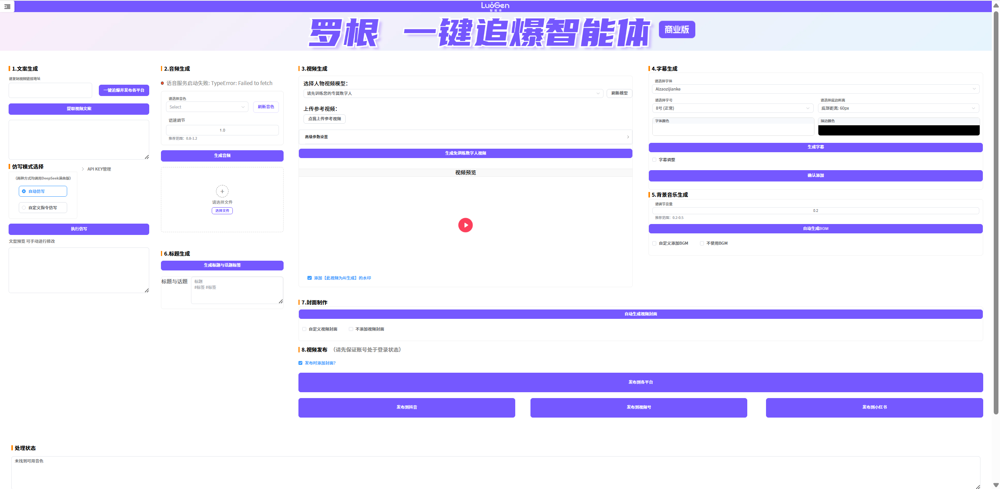

# `真正的商业级应用` 🚀 一键生成爆款视频自动化工具

- 由于代码体积及模型文件过大，请诸位移步 [代码地址](代码地址.txt) 进行下载。
- 由于该应用为本地运行的客户端应用，为了诸位的使用体验，先进行 [使用前必装](使用前必装.txt) 进行下载安装。

> 诸多不便，敬请谅解。

**项目描述**  
本工具通过自动化流程，帮助用户快速生成高质量的数字人口播视频并发布至多平台。核心功能包括：
- 📝 **智能文案处理**：自动提取对标文案 + 智能仿写优化
- 🎤 **声音克隆**：基于 Whisper 和 CosyVoice 实现高保真语音合成
- 👥 **数字人生成**：集成 HeyGem 实现自然口播效果
- 🎬 **全流程视频制作**：字幕/BGM/标题/封面自动生成 + 多平台发布

## 🌟 核心功能
| 功能模块          | 技术实现                     |
|-------------------|------------------------------|
| 语音克隆          | Whisper（语音识别） + CosyVoice（语音合成） |
| 数字人口播        | HeyGem 数字人引擎            |
| 视频后期          | FFmpeg（合成） + 动态字幕    |
| 多平台发布        | 平台 API 集成（抖音/B站等）  |

## 🤝 致谢
本项目基于以下优秀开源项目构建：
- [social-auto-upload](https://github.com/...) - 多平台发布框架
- [CosyVoice](https://github.com/tencent-ailab/cosyvoice) - 高质量语音合成
- [HeyGem](https://github.com/...) - 数字人驱动引擎
- [Whisper](https://github.com/openai/whisper) - 精准语音识别

## ⚠️使用限制
- 本项目仅限个人学习、研究使用，严禁任何形式的商业用途（包括但不限于售卖工具、提供付费服务等）。
